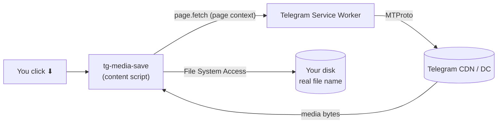
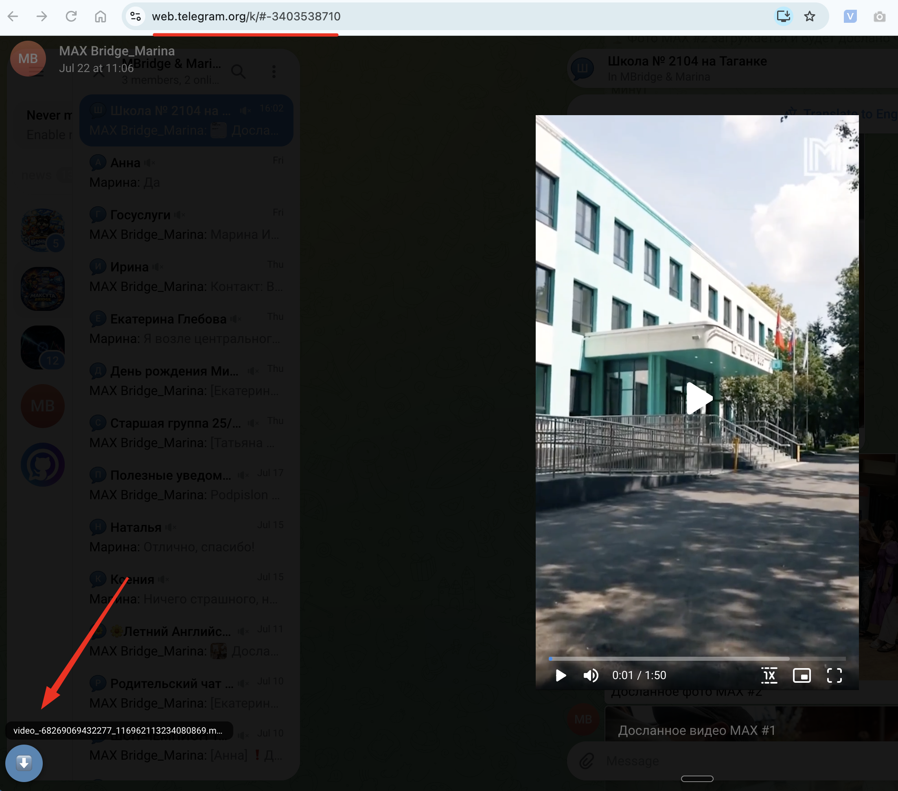

# tg-media-save

> Local fork 1.0.2: see [中文安装与修复说明](README.zh-CN.md). Build locally with `npm run build` (Node.js + Python 3). Download links below point to this repository.

**Русский → [README.ru.md](./README.ru.md)**

**The download button Telegram Web is missing.**

tg-media-save saves **photos, videos, GIFs and voice messages** from
[Telegram Web](https://web.telegram.org) (the `/k/` and `/z/` clients) — right from the chat
feed, with real file names, in one click. One source, two distribution modes: a Tampermonkey
userscript and a Chrome MV3 extension. Not affiliated with Telegram.

> ⚠️ **Responsible use.** The tool only works with what your account can already see in Telegram.
> Use it only for content you have the rights to (your own files, permitted materials). Respect
> Telegram's Terms of Service and content owners' copyright.

---

## What tg-media-save does for you

You're watching a lecture in a Telegram channel. A diagram you need. A voice memo worth keeping.
You right-click — and there's no "Save as". The channel turned it off.

tg-media-save puts the button back.

| You want to… | You do… | You get… |
|---|---|---|
| Save a video from the feed | Click ⬇ on the video | The original file, real name, streamed straight to disk |
| Keep a voice message | Click ⬇ on the audio | The `.ogg` file |
| Grab a photo or GIF | Click ⬇ on the image | The full-resolution image |
| Save the last thing you played | Click the floating ⬇ (bottom-left) | Whatever media the page loaded last |

### What it will not do — by design

- **Post, vote, comment, or log in as you.** It is strictly read-only.
- **Collect or send any data anywhere.** Everything happens locally in your browser.
- **Ask for permissions** beyond running on `web.telegram.org`.

---

## Features

- ⬇ inline save buttons on feed media, plus a floating ⬇ for the last loaded media.
- Real file **names and sizes**, parsed from Telegram's stream descriptor.
- Large files stream **straight to disk** (File System Access API), with an in-memory fallback.
- Bypasses Telegram's strict Content-Security-Policy (content-script injection, not page-world).
- **No telemetry, no accounts, no dependencies** at runtime. MIT-licensed.

---

## How it works

Telegram Web serves media through its own **Service Worker** at `/k/stream/{json descriptor}`.
tg-media-save runs as a content script (bypassing the strict CSP), discovers the media URL, and
fetches it **in the page context** so the Service Worker serves the bytes — then streams them to
your disk with the real file name.

Full details, ASCII diagrams and the build pipeline: [`docs/ARCHITECTURE.md`](docs/ARCHITECTURE.md).

---

## Demo

A video post in a Telegram Web channel — the address bar shows `web.telegram.org/k/…`.
tg-media-save adds a ⬇ button right on the media in the feed; click it to save the file with
its real name. No separate app — it runs right in your browser.

---

## Install

### Mode 1 — Chrome extension: download & load unpacked (easiest)

No git, no build, no Tampermonkey.

1. Download [`tg-media-save-extension.zip`](https://github.com/LazyFaiz/tg-media-save/raw/main/dist/tg-media-save-extension.zip)
   and unzip it.
2. Open `chrome://extensions` and enable **Developer mode** (top-right).
3. Click **Load unpacked** and select the **unzipped folder** (the one with `manifest.json`).
4. Hard-reload Telegram (Cmd/Ctrl+Shift+R).

> Chrome may show a "Disable developer mode extensions" notice on launch — normal for unpacked
> extensions; just dismiss it (keep Developer mode on).

### Mode 2 — Userscript (Tampermonkey / Violentmonkey)

1. Install [Tampermonkey](https://www.tampermonkey.net/) or [Violentmonkey](https://violentmonkey.github.io/).
2. **Chrome (MV3):** enable Tampermonkey's **"Allow user scripts"** in `chrome://extensions`.
3. Install — **one click:** open
   [`tg-media-save.user.js`](https://raw.githubusercontent.com/LazyFaiz/tg-media-save/main/tg-media-save.user.js);
   or **manually:** paste its contents into a new script.
4. Hard-reload Telegram (Cmd/Ctrl+Shift+R).

### Mode 3 — From source (for developers & contributors)

To modify, inspect, or build the extension yourself — or to run the latest `main` before a
release zip is published.

1. Open `chrome://extensions` and enable **Developer mode**.
2. Clone the repo, then click **Load unpacked** and select the [`extension/`](extension) folder
   (the one with `manifest.json`). To rebuild from source, see
   [docs/ARCHITECTURE.md](docs/ARCHITECTURE.md#building-from-source).
3. Hard-reload Telegram (Cmd/Ctrl+Shift+R).

> Use **one mode at a time** (otherwise the buttons duplicate). The extension is not blocked by
> the page CSP and needs no "Allow user scripts" toggle.

---

## Usage

1. **Play** the video/audio (or open the photo) so the page loads the media.
2. Click ⬇ **on the media** — or the floating ⬇ bottom-left.
3. The file saves with its real name; progress shows as a percent.

Console helpers: `tgSaver.status()`, `tgSaver.downloadLast()`, `tgSaver.debug(true)`.

---

## Documentation

| Document | Topic |
|---|---|
| [`docs/ARCHITECTURE.md`](docs/ARCHITECTURE.md) | How it works (diagrams), build pipeline, project structure |
| [`test/README.md`](test/README.md) | What is tested and how (`npm test`, no dependencies) |
| [`docs/TROUBLESHOOTING.md`](docs/TROUBLESHOOTING.md) | No buttons, Service Worker errors, updating |
| [`AGENTS.md`](AGENTS.md) | Notes for developers and AI agents |
| [`CHANGELOG.md`](CHANGELOG.md) | Release history |

---

## Contributing

Bug reports and ideas — in [Issues](https://github.com/LazyFaiz/tg-media-save/issues).
PRs welcome: edit [`src/content.js`](src/content.js), run `./scripts/build.sh`, and make sure
`npm test` passes.

---

## License

[MIT](LICENSE) © 2026 Denis Ermilov
