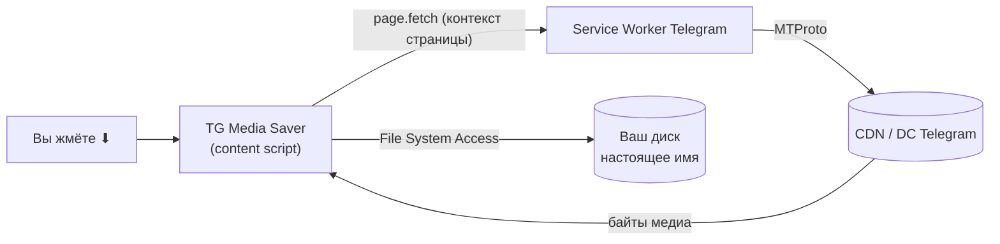

# TG Media Saver

**English → [README.md](./README.md)**

**Та самая кнопка скачивания, которой не хватает в Telegram Web.**

TG Media Saver сохраняет **фото, видео, GIF и голосовые сообщения** из
[Telegram Web](https://web.telegram.org) (клиенты `/k/` и `/z/`) — прямо из ленты чата, с
настоящими именами файлов, в один клик. Один источник, два режима: userscript для Tampermonkey и
расширение Chrome MV3. Не аффилировано с Telegram.

> ⚠️ **Ответственное использование.** Инструмент работает только с тем, что ваш аккаунт и так
> видит в Telegram. Используйте его лишь для контента, на который у вас есть права (ваши файлы,
> разрешённые материалы). Соблюдайте условия использования Telegram и авторские права владельцев.

---

## Что TG Media Saver делает для вас

Вы смотрите лекцию в Telegram-канале. Нужная схема. Голосовое, которое стоит сохранить.
Правый клик — а «Сохранить как» нет. Канал это отключил.

TG Media Saver возвращает кнопку.

| Вы хотите… | Вы делаете… | Вы получаете… |
|---|---|---|
| Сохранить видео из ленты | Клик ⬇ на видео | Оригинальный файл, настоящее имя, стриминг сразу на диск |
| Сохранить голосовое | Клик ⬇ на аудио | Файл `.ogg` |
| Забрать фото или GIF | Клик ⬇ на картинке | Изображение в полном разрешении |
| Сохранить последнее воспроизведённое | Клик по плавающей ⬇ (слева внизу) | То медиа, что страница загрузила последней |

### Чего он НЕ делает — по замыслу

- **Не постит, не голосует, не комментирует и не логинится за вас.** Строго read-only.
- **Ничего не собирает и никуда не отправляет.** Всё происходит локально в вашем браузере.
- **Не просит разрешений** сверх работы на `web.telegram.org`.

---

## Возможности

- ⬇ кнопки сохранения на медиа в ленте + плавающая ⬇ для последнего загруженного медиа.
- Настоящие **имена и размеры** файлов — из дескриптора потока Telegram.
- Большие файлы пишутся **напрямую на диск** (File System Access API), с фолбэком в память.
- Обходит строгий Content-Security-Policy Telegram (инжект как content script, а не в мир страницы).
- **Без телеметрии, аккаунтов и рантайм-зависимостей.** Лицензия MIT.

---

## Как это работает

Telegram Web отдаёт медиа через свой **Service Worker** по адресу `/k/stream/{json-дескриптор}`.
TG Media Saver работает как content script (обходя строгий CSP), находит ссылку на медиа и
запрашивает её **в контексте страницы**, чтобы Service Worker отдал байты, — а затем пишет их на
диск с настоящим именем файла.

Подробности, ASCII-диаграммы и конвейер сборки: [`docs/ARCHITECTURE.md`](docs/ARCHITECTURE.md).

---

## Установка

### Режим 1 — Userscript (Tampermonkey / Violentmonkey)

1. Установите [Tampermonkey](https://www.tampermonkey.net/) или [Violentmonkey](https://violentmonkey.github.io/).
2. **Chrome (MV3):** включите **«Allow user scripts»** у Tampermonkey в `chrome://extensions`.
3. Установка — **в один клик:** откройте
   [`tg-media-saver.user.js`](https://raw.githubusercontent.com/eiler2005/tg-media-saver/main/tg-media-saver.user.js);
   или **вручную:** вставьте его содержимое в новый скрипт.
4. Жёстко обновите Telegram (Cmd/Ctrl+Shift+R).

### Режим 2 — Расширение Chrome (MV3, Chrome 111+)

1. Откройте `chrome://extensions` и включите **Developer mode**.
2. Нажмите **Load unpacked** и выберите папку [`extension/`](extension) (ту, где
   `manifest.json`). Для сборки из исходников см.
   [docs/ARCHITECTURE.md](docs/ARCHITECTURE.md#building-from-source).
3. Жёстко обновите Telegram (Cmd/Ctrl+Shift+R).

> Используйте **один режим за раз** (иначе кнопки задвоятся). Расширение не блокируется CSP
> страницы и не требует тумблера «Allow user scripts».

---

## Как пользоваться

1. **Воспроизведите** видео/аудио (или откройте фото), чтобы страница загрузила медиа.
2. Нажмите ⬇ **на медиа** — или плавающую ⬇ слева внизу.
3. Файл сохранится с настоящим именем; прогресс — в процентах.

Консольные хелперы: `tgSaver.status()`, `tgSaver.downloadLast()`, `tgSaver.debug(true)`.

---

## Документация

| Документ | Тема |
|---|---|
| [`docs/ARCHITECTURE.md`](docs/ARCHITECTURE.md) | Как работает (диаграммы), конвейер сборки, структура проекта |
| [`test/README.md`](test/README.md) | Что и как проверяется (`npm test`, без зависимостей) |
| [`docs/TROUBLESHOOTING.md`](docs/TROUBLESHOOTING.md) | Нет кнопок, ошибки Service Worker, обновление |
| [`AGENTS.md`](AGENTS.md) | Заметки для разработчиков и AI-агентов |
| [`CHANGELOG.md`](CHANGELOG.md) | История релизов |

---

## Вклад

Багрепорты и идеи — в [Issues](https://github.com/eiler2005/tg-media-saver/issues).
PR приветствуются: правьте [`src/content.js`](src/content.js), запускайте `./scripts/build.sh`
и убедитесь, что `npm test` проходит.

---

## Лицензия

[MIT](LICENSE) © 2026 Denis Ermilov
